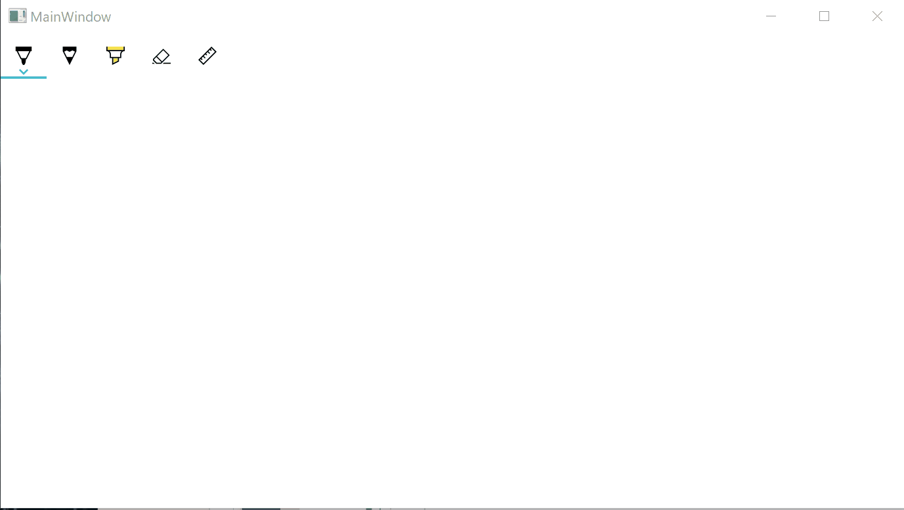

# GyutanKaigi2019

2019/12/14 に仙台で開催された [牛タン会議 2019](https://vsuc.connpass.com/event/156131/) で登壇したときに行ったデモのプログラムです。

登壇資料は [WPF on .NET Core 3.1 で Windows 10 アプリ開発](https://www.slideshare.net/okazuki0130/wpf-on-net-core-31-windows-10) にアップロードしています。

手書き文字認識デモをしたときに認識が失敗したとき用に録画しておいた gif アニメもあります。

